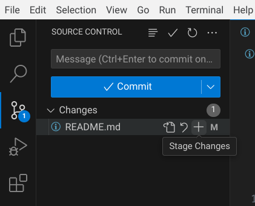

# homework

- Add .gitignore
- Try something new!

```C
#include <stdio.h>

int main()
{
    printf("Hello world!\n");

    return 0;
}
```



---

- vs: add history
- gh: pwd less auth
- gh: create new repo
- vs: clone repo
- gh: set uname, email
- vs: new branch
- vs: Add .gitignore
- vs: update .gitignore .history
- vs: git add, commit, push
- gh: pull request
- vs: update, git add commit, push
- gh: merge to main

